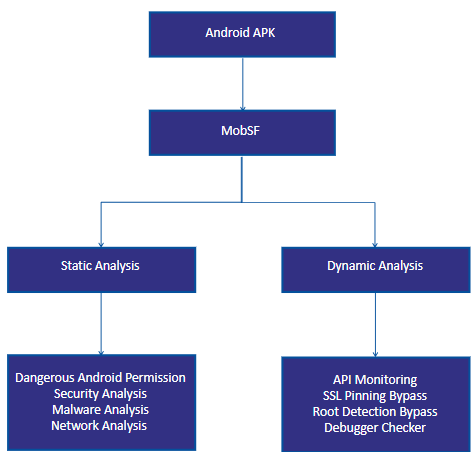

# Project Name: API Flow Analyzer
Team Name: SafeSurfers
## Introduction
Android devices have become more widespread lately. A recent study highlights that more and more security issues concerning data privacy in preinstalled system apps have emerged. Many preinstalled apps send critical information to third-party domains without the user's knowledge. In this project, we will investigate whether these security risks are present on Android smartphones sold in Singapore. The results will reveal whether Singapore-sold Android smartphones are vulnerable to such security threats and whether immediate actions such as upgrading security defenses or raising awareness among locals are required. 

In this project, we will go over the tools and features used to retrieve data for analysis. In addition, we will discuss the data-driven findings and possible reasons for the given outcomes. 
## Tools Used
<uL>
  <li>MobSF</li>
  <li>Androwarn</li>
  <li>Mobexler</li>
  <li>JD-GUI</li>
  <li>Burp Suite</li>
</uL>

## Application used
<uL>
  <li>Chrome</li>
  <li>Drive</li>
  <li>Maps</li>
  <li>Photos</li>
  <li>YouTube</li>
  <li>YouTube Music</li>
</uL>

## Types of analysis done

